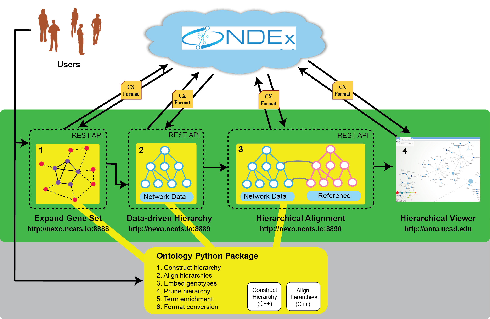

Introduction
============

The Data-Driven Ontology Toolkit (ddot) simplifies the construction,
analysis, and visualization of biological hierarchies. ddot consists
of both a Python package and a portable set of RESTful services.

   
Features
---------

#. Inspection of hierarchical structure
   
   #. Query connections between genes and terms
   #. Query connections betwween child and parent terms
   #. Query node and edge attributes
      
#. Manipulation of hierarchy
   
   #. Deleting genes and terms
   #. Renaming gene and term names
   #. Propagating gene-term connections
   #. Randomization of structure
      
#. Assembly of a hierarchy by the CLIXO algorithm
   
#. Analysis of hierarchy
   
   #. Alignment with a reference hierarchy
   #. Semantic similarity
      
#. Visualization of hierarchy
   
   #. Automatic node layout and styling
   #. `Web-based Hierarchical Viewer <http://hiview.ucsd.edu>`_
   #. `Cytoscape <www.cytoscape.org>`_
	    
#. Translation of Genotype to Phenotype
   
   #. Convert genotype to ontotypes
   #. FUTURE: train neural network
      
#. Interfaces to other libraries
   
   #. Graph libraries: NetworkX, iGraph
   #. Tables: Pandas and CSV files
      
#. RESTful web services
   
   #. Expand Gene Set: Identify genes whose functions are highly similar to a seed set of genes.
   #. Build Data-driven Hierarchy: Run the CLiXO algorithm to derive a hierarchy relating
   #. Hierarchical Alignment: Identify terms in a hierarchy that highly match terms in a reference hierarchy, such as the Gene Ontology.
   #. Hierarchical Viewer: Interactively browse the structure of a hierarchy, including the data that supports the existence of each term in the hierarchy.
   
Sharing results with the Network Database Exchange (NDEx)
---------------------------------------------------------

A core objective of DDOT is not only to provide programmatic tools for
data-driven ontologies, but also to pipelines based on thxese tools
more transparent, shareable, and reproducible. To this end, both the
Python package and web services can take in data and output results
via networks stored in the Network Database Exchange (NDEx). NDEx is a
cloud storage system that (Figure showing ontology in NDEx). This
seamless connection with NDEx provides three advantages. First, it
enables a standard data format: a user need only worry about the
simpler task of uploading data to NDEx. Second, input and output data
can be shared with others through URLs. Third, it provides a bridge to
other NDEx features, including provenance tracking and
synchronization.

Installation
------------

The recommended method of installation is by 'pip'::

   pip install ddot

Dependencies
-------------

Each of the following packages can be installed using `pip install ...`

#. `cxmate <https://pypi.python.org/pypi/cxmate>`_
#. `networkx <https_://networkx.github.io/>`_
#. `python-igraph <http://igraph.org/python/>`_
#. `pandas <http://pandas.pydata.org/>`_
#. `numpy and scipy <https://docs.scipy.org/doc/>`_
#. `ndex-dev <https://github.com/ndexbio/ndex-python>`_
#. `requests <http://docs.python-requests.org/en/master/>`_
   
Journal References
------------------

#. Yu, M.K., Kramer, M., Dutkowski, J., Srivas, R., Licon, K.,
   Kreisberg, J.F., Ng, C.T., Krogan, N., Sharan, R. and Ideker,
   T., 2016. "Translation of genotype to phenotype by a hierarchy of
   cell subsystems". *Cell Systems*, 2(2), pp.77-88.

#. Kramer, M., Dutkowski, J., Yu, M., Bafna, V. and Ideker,
   T., 2014. "Inferring gene ontologies from pairwise similarity
   data." *Bioinformatics*, 30(12), pp.i34-i42.

#. Kramer, M.H., Farre, J.C., Mitra, K., Yu, M.K., Ono, K., Demchak,
   B., Licon, K., Flagg, M., Balakrishnan, R., Cherry, J.M. and
   Subramani, S., 2017. "Active Interaction Mapping Reveals the
   Hierarchical Organization of Autophagy". *Molecular Cell*, 65(4),
   pp.761-774.

#. Dutkowski, J., Ono, K., Kramer, M., Yu, M., Pratt, D.,
   Demchak, B. and Ideker, T., 2013. "NeXO Web: the NeXO ontology
   database and visualization platform." *Nucleic acids research*,
   42(D1), pp.D1269-D1274.

#. Dutkowski, J., Kramer, M., Surma, M.A., Balakrishnan, R., Cherry,
   J.M., Krogan, N.J. and Ideker, T., 2013. "A gene ontology inferred
   from molecular networks." *Nature biotechnology*, 31(1).

