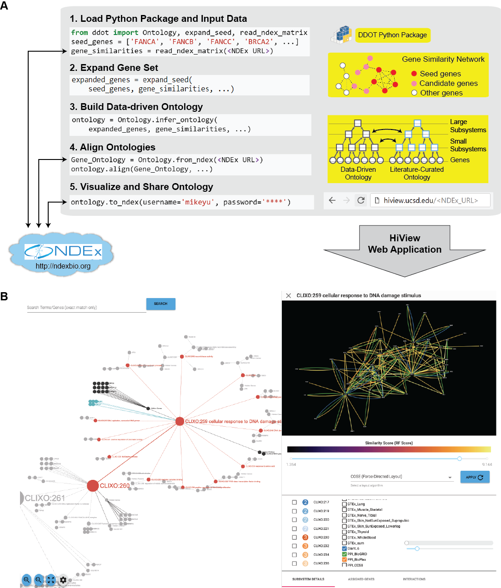

Welcome to Data-Driven Ontology Toolkit's documentation!
========================================================

The Data-Driven Ontology Toolkit (DDOT) is an open source package that
facilitates the inference, analysis, and visualization of biological
hierarchies using a data structure called an ontology.

Getting started
---------------

1. Install DDOT using the instructions on the `github page <https://github.com/michaelkyu/ddot>`_.
2. Go through the `tutorial <https://github.com/michaelkyu/ddot/blob/master/examples/Tutorial.ipynb>`_.
3. Browse a list of DDOT functions in :ref:`ontology-ref` and :ref:`utils-ref`.
4. Post questions or issues to the `Google Groups forum <https://groups.google.com/forum/#!forum/ontology>`_.
  
Features
--------

      
#. **Build Data-Driven Ontology:** Given a set of genes and a gene
   similarity network, hierarchically cluster the genes to infer
   cellular subsystems using the CliXO algorithm (Kramer et
   al. Bioinformatics 2014). The resulting hierarchy of subsystems
   defines a data-driven ontology.

#. **Align Ontologies:** Annotate a data-driven ontology by aligning
   it to a curated ontology such as the Gene Ontology (GO). For
   instance, if a data-driven subsystem contains a similar set of
   genes as the GO term for DNA repair, then annotate this subsystem
   as being involved in DNA repair. Data-driven subsystems with no
   such matches represent new molecular mechanisms.

#. **Visualize Hierarchical Structure:** Browse the full hierarchical
   structure of a data-driven ontology, including the network of gene
   similarities used to infer it, in a web application called the
   Hierarchical Viewer (HiView, http://hiview.ucsd.edu)

#. **Examine ontology structure:** For each subsystem, retrieve its
   hierarchical connections (genes, child and descendant subsystems,
   parent and ancestral subsystems) and the subnetwork of gene
   similarities that supports the subsystem’s existence. For each
   gene, retrieve its set of subsystems.

#. **Modify ontology structure:** Reduce the size of an ontology by
   removing a set of subsystems or genes. Randomize connections
   between genes and subsystems to create new ontologies representing
   a null model for statistical tests.

#. **Flatten ontology structure:** Instead of inferring an ontology
   from a gene similarity network, perform the reverse process of
   inferring a gene similarity network from an ontology. In
   particular, the similarity between two genes is calculated as the
   size of the smallest common subsystem, known as the Resnik score.
   
#. **Expand Gene Set:** Given a set of genes as a “seed set” and a
   gene similarity network, identify an expanded set of genes that are
   highly similar to the seed set. This function can broaden the scope
   of a data-driven ontology beyond genes that are already well known.

#. **Map genotypes to the ontology:** Given a set of mutations
   comprising a genotype, propagate the impact of these mutations to
   the subsystems containing these genes in the ontology. In
   particular, the impact on a subsystem is estimated by the number of
   its genes that have been mutated. These subsystem activities, which
   we have called an “ontotype”, enables more accurate and
   interpretable predictions of phenotype from genotype (Yu et al. Cell Systems 2016).

#. **Load curated ontologies:** Parse Open Biomedical Ontologies (OBO)
   and gene-association file (GAF) formats that are typically used to
   describe curated ontologies like GO.

#. **Interface with Network Data Exchange:** Ontologies and networks
   can be stored and retrieved online at NDEx (http://ndexbio.org). We
   encourage use of NDEx to make DDOT-based software pipelines more
   reproducible and shareeable with others.

#. **Interface with other tools and Python libraries:** DDOT can
   readily interface with other desktop applications, such as
   Cytoscape, and other programming libraries in Python, such as the
   Pandas, NetworkX, igraph, and matplotlib.

How to cite
-----------

If you use DDOT for your research, please cite

Yu MK, Ma J, Ono K, Zheng F, Fong S, Gary A, Chen J, Demchak B, Pratt
D, Ideker T. "A swiss-army knife for hierarchical modeling of
biological systems." (in preparation)
   

References
----------
   
#. Yu MK, Kramer M, Dutkowski J, Srivas R, Licon K, Kreisberg JF, Ng
   CT, Krogan N, Sharan R, Ideker T. "Translation of genotype to
   phenotype by a hierarchy of cell subsystems". *Cell Systems*, 2(2),
   pp.77-88. 2016.

#. Kramer M, Dutkowski J, Yu M, Bafna V, Ideker T. "Inferring gene
   ontologies from pairwise similarity data." *Bioinformatics*,
   30(12), pp.i34-i42. 2014.

#. Kramer MH, Farre JC, Mitra, K, Yu MK, Ono K, Demchak B, Licon K,
   Flagg M, Balakrishnan R, Cherry JM, Subramani S, Ideker T. "Active
   Interaction Mapping Reveals the Hierarchical Organization of
   Autophagy". *Molecular Cell*, 65(4), pp.761-774. 2017.

#. Dutkowski J, Ono K, Kramer M, Yu M, Pratt D, Demchak B,
   Ideker T. "NeXO Web: the NeXO ontology database and visualization
   platform." *Nucleic Acids Research*, 42(D1), pp.D1269-D1274. 2013.

#. Dutkowski J, Kramer M, Surma MA, Balakrishnan R, Cherry JM, Krogan
   NJ, Ideker T. "A gene ontology inferred from molecular
   networks." *Nature Biotechnology*, 31(1). 2013.
